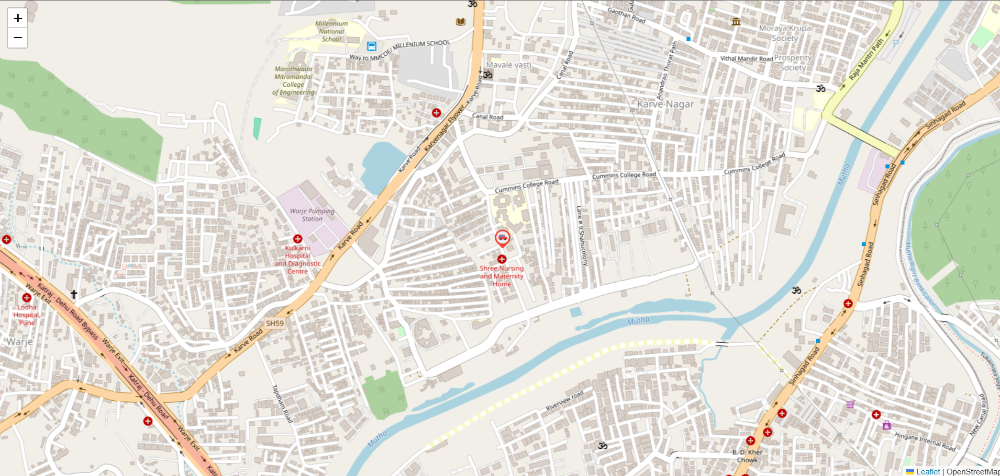

# realtime vehicle tracking app 

- we have different coordinates which we get while the vehicle will get move so for now i have used my nearby location coordinates in data.json file

# current location 
- i have set my current location coordinates(latitude, longitude) which will be the initial location coordinate of an vehicle (script.js line no. 1).

# start backend server
- for starting the server use this command "npm start"

# open browser
- go to browser enter [http://localhost:3000](http://localhost:3000/) here you will be able to see how it works.

# image
